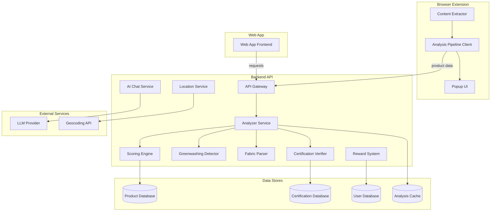

# Design Document: Sustainable Fashion Checker

## Overview

The Sustainable Fashion Checker (EcoPulse) is a hybrid system consisting of a browser extension and a companion web application. The extension intercepts clothing product pages, extracts product data (fabric composition, claims, certifications), and runs it through an analysis pipeline that produces a three-axis sustainability score. The web app provides detailed breakdowns, sustainable alternatives, AI-powered material inquiries, reward points tracking, and donation/recycling location lookup.

The system follows a client-server architecture where the browser extension acts as a lightweight client that delegates heavy analysis to a backend API. The web app is a separate frontend that shares the same backend services.

### Key Design Decisions

- **Hybrid Architecture**: The browser extension handles data extraction and displays a summary popup; the backend API performs all scoring, greenwashing detection, and certification verification. This keeps the extension lightweight and allows centralized updates to analysis logic.
- **Three-Axis Scoring Model**: Environmental impact, health transparency, and greenwashing risk are scored independently (0–100) to give users granular insight rather than a single opaque number.
- **Round-Trip Fabric Parsing**: Fabric composition parsing is designed with a round-trip property (parse → format → parse = identity) to ensure data integrity throughout the pipeline.
- **Curated Product Database**: Sustainable alternatives come from a curated, verified database rather than open web scraping, ensuring recommendation quality.

## Architecture



### Data Flow

1. **Extension → Backend**: The content extractor scrapes the product page DOM, packages the raw data (fabric text, claims, certification mentions), and sends it to the API.
2. **Analyzer Pipeline**: The Analyzer orchestrates sub-services: Fabric Parser structures the composition, Certification Verifier checks claims, Greenwashing Detector flags vague terms, and the Scoring Engine computes the three scores.
3. **Backend → Extension**: The API returns a summary response (three scores + overall green/red indicator) for the popup.
4. **Web App**: Fetches the full analysis from the API, including detailed breakdowns, alternatives from the Product Database, and location data.

## Components and Interfaces

### 1. Content Extractor (Extension)

Runs as a content script in the browser. Extracts product data from the DOM of supported retailer pages.

```typescript
interface ExtractedProductData {
  url: string;
  productName: string;
  brand: string;
  fabricCompositionText: string;
  sustainabilityClaims: string[];
  certificationMentions: string[];
  price: number | null;
  currency: string | null;
  category: string | null;
}

interface ContentExtractor {
  extract(document: Document): ExtractedProductData | null;
}
```

### 2. Fabric Parser

Parses raw fabric composition text into structured data and formats it back. Designed with a round-trip guarantee.

```typescript
interface FabricComponent {
  material: string;       // e.g., "Cotton", "Polyester"
  percentage: number;     // 0-100
  qualifier?: string;     // e.g., "Organic", "Recycled"
}

interface ParseResult {
  components: FabricComponent[];
  isComplete: boolean;    // false if ambiguous/incomplete
  rawText: string;
}

interface FabricParser {
  parse(text: string): ParseResult;
  format(components: FabricComponent[]): string;
}
```

### 3. Certification Verifier

Validates certification claims against a maintained database of recognized certifications.

```typescript
interface Certification {
  id: string;
  name: string;           // e.g., "GOTS", "OEKO-TEX Standard 100"
  aliases: string[];      // alternative names/abbreviations
  category: string;       // "environmental" | "health" | "social"
}

interface VerificationResult {
  claim: string;
  matched: Certification | null;
  verified: boolean;
}

interface CertificationVerifier {
  verify(claims: string[]): VerificationResult[];
}
```

### 4. Greenwashing Detector

Identifies vague or misleading sustainability claims.

```typescript
interface GreenwashingSignal {
  term: string;                    // the flagged term
  context: string;                 // surrounding text
  severity: "low" | "medium" | "high";
  explanation: string;             // why it's considered greenwashing
}

interface GreenwashingDetector {
  detect(claims: string[], verifiedCertifications: string[]): GreenwashingSignal[];
}
```

### 5. Scoring Engine

Computes the three-axis score from analysis results.

```typescript
interface ScoringInput {
  fabricComponents: FabricComponent[];
  certificationResults: VerificationResult[];
  greenwashingSignals: GreenwashingSignal[];
  chemicalRisks: ChemicalRisk[];
}

interface ProductScore {
  environmental: number;   // 0-100
  health: number;          // 0-100
  greenwashing: number;    // 0-100
  overallIndicator: "green" | "red";
}

interface ScoringEngine {
  computeScore(input: ScoringInput): ProductScore;
}
```

### 6. AI Chat Service

Handles conversational queries about materials, chemicals, and brand claims.

```typescript
interface ChatMessage {
  role: "user" | "assistant";
  content: string;
  timestamp: Date;
}

interface ChatResponse {
  message: string;
  confidence: "high" | "medium" | "low";
  sources?: string[];
}

interface AIChatService {
  query(userMessage: string, conversationHistory: ChatMessage[]): Promise<ChatResponse>;
  analyzeMaterialComposition(compositionText: string): Promise<ChatResponse>;
}
```

### 7. Reward System

Tracks and awards points for sustainable behaviors.

```typescript
type RewardEventType = "purchase" | "rewear" | "donation" | "repair" | "recycle";

interface RewardEvent {
  userId: string;
  type: RewardEventType;
  points: number;
  itemDescription: string;
  timestamp: Date;
}

interface RewardSystem {
  awardPoints(event: RewardEvent): Promise<void>;
  getBalance(userId: string): Promise<number>;
  getHistory(userId: string): Promise<RewardEvent[]>;
}
```

### 8. Location Service

Finds nearby donation centers and recycling facilities.

```typescript
interface Location {
  id: string;
  name: string;
  address: string;
  acceptedItemTypes: string[];
  operatingHours: string;
  latitude: number;
  longitude: number;
  type: "donation" | "recycling";
}

interface LocationService {
  findNearby(lat: number, lng: number, radiusKm: number): Promise<Location[]>;
  getDirectionsUrl(location: Location): string;
}
```


### 9. API Gateway

REST API that routes requests to the appropriate backend services.

```
POST /api/analyze          → Analyzer Service (full product analysis)
GET  /api/analysis/:id     → Cached analysis result
POST /api/chat             → AI Chat Service
GET  /api/alternatives     → Product Database query
POST /api/rewards          → Reward System (log event)
GET  /api/rewards/:userId  → Reward System (balance + history)
GET  /api/locations        → Location Service (nearby facilities)
```

## Data Models

### Product Analysis

```typescript
interface ProductAnalysis {
  id: string;
  url: string;
  productName: string;
  brand: string;
  fabricComposition: ParseResult;
  certificationResults: VerificationResult[];
  greenwashingSignals: GreenwashingSignal[];
  chemicalRisks: ChemicalRisk[];
  score: ProductScore;
  analyzedAt: Date;
}
```

### Chemical Risk

```typescript
interface ChemicalRisk {
  substance: string;
  riskLevel: "low" | "medium" | "high";
  associatedMaterials: string[];
  healthEffects: string[];
}
```

### User

```typescript
interface User {
  id: string;
  email: string;
  rewardPoints: number;
  createdAt: Date;
}
```

### Sustainable Alternative

```typescript
interface SustainableAlternative {
  id: string;
  productName: string;
  brand: string;
  category: string;
  price: number;
  currency: string;
  score: ProductScore;
  certifications: string[];
  purchaseUrl: string;
}
```

### Certification Record

```typescript
interface CertificationRecord {
  id: string;
  name: string;
  aliases: string[];
  category: "environmental" | "health" | "social";
  description: string;
  verificationUrl: string;
}
```


## Correctness Properties

*A property is a characteristic or behavior that should hold true across all valid executions of a system — essentially, a formal statement about what the system should do. Properties serve as the bridge between human-readable specifications and machine-verifiable correctness guarantees.*

### Property 1: Score range and completeness invariant

*For any* valid `ScoringInput`, the `ScoringEngine.computeScore` function SHALL return a `ProductScore` containing exactly three numeric scores (environmental, health, greenwashing), each within the inclusive range [0, 100].

**Validates: Requirements 2.1, 2.2**

### Property 2: Overall indicator threshold rule

*For any* `ProductScore`, the `overallIndicator` SHALL be `"green"` if and only if all three scores (environmental, health, greenwashing) are greater than or equal to 50. Otherwise, the `overallIndicator` SHALL be `"red"`.

**Validates: Requirements 2.3, 2.4**

### Property 3: Greenwashing detection of uncertified vague claims

*For any* set of sustainability claims containing a known vague term (e.g., "eco-friendly", "green", "natural", "conscious") and an empty set of verified certifications for that claim, the `GreenwashingDetector.detect` function SHALL return at least one `GreenwashingSignal` referencing that term.

**Validates: Requirements 3.1**

### Property 4: Greenwashing score monotonicity

*For any* two `ScoringInput` instances that are identical except that one has strictly more greenwashing signals (or higher severity signals) than the other, the `ScoringEngine` SHALL produce a lower greenwashing risk score for the input with more/higher-severity signals.

**Validates: Requirements 3.2**

### Property 5: Greenwashing signals rendering completeness

*For any* list of `GreenwashingSignal` objects, the Web_App's greenwashing detail rendering SHALL produce output containing every signal's `term` and `explanation`.

**Validates: Requirements 3.3**

### Property 6: Environmental analysis rendering completeness

*For any* `ProductAnalysis`, the Web_App's environmental analysis section rendering SHALL produce output containing the fabric composition breakdown, environmental impact for each material, and certification status for each certification result.

**Validates: Requirements 4.3**

### Property 7: Health analysis rendering completeness

*For any* `ProductAnalysis` containing one or more `ChemicalRisk` entries, the Web_App's health analysis section rendering SHALL produce output containing every chemical risk's substance name and associated health effects.

**Validates: Requirements 4.4**

### Property 8: Alternatives category matching

*For any* clothing category and Product_Database, all `SustainableAlternative` items returned by the alternatives query SHALL have a `category` field matching the queried category.

**Validates: Requirements 5.1**

### Property 9: Alternatives sorted by score descending

*For any* list of `SustainableAlternative` items returned by the alternatives query, the list SHALL be sorted by `score.environmental + score.health + score.greenwashing` (or the composite sustainability score) in descending order.

**Validates: Requirements 5.2**

### Property 10: Alternative rendering completeness

*For any* `SustainableAlternative`, the rendered output SHALL contain the product's `price`, `Sustainability_Score`, and `brand` name.

**Validates: Requirements 5.3**

### Property 11: Affordable alternatives price filter

*For any* original product price and Product_Database, all alternatives returned when the affordable filter is active SHALL have a `price` less than or equal to the original product's price.

**Validates: Requirements 5.4**

### Property 12: Reward points accumulation invariant

*For any* sequence of `RewardEvent` instances (of any type: purchase, rewear, donation, repair, recycle) applied to a user account, the user's cumulative `rewardPoints` balance SHALL equal the sum of all `points` values from the applied events.

**Validates: Requirements 7.1, 7.2, 7.3, 7.4, 7.5, 7.6**

### Property 13: Location proximity constraint

*For any* user-provided latitude/longitude and search radius, all `Location` objects returned by `LocationService.findNearby` SHALL be within the specified radius (in km) of the user's coordinates.

**Validates: Requirements 8.1**

### Property 14: Location rendering completeness

*For any* `Location` object, the rendered output SHALL contain the location's `name`, `address`, `acceptedItemTypes`, and `operatingHours`.

**Validates: Requirements 8.2**

### Property 15: Fabric composition parse-format round trip

*For any* valid `FabricComponent[]` array, `parse(format(components))` SHALL produce a `ParseResult` whose `components` are equivalent to the original array (same materials, percentages, and qualifiers).

**Validates: Requirements 9.1, 9.3, 9.4**

### Property 16: Certification verification correctness

*For any* certification claim string and certification database, the `CertificationVerifier.verify` function SHALL return `verified: true` with a matching `Certification` if and only if the claim matches a recognized certification's name or alias. Otherwise, it SHALL return `verified: false` with `matched: null`.

**Validates: Requirements 10.1, 10.2, 10.3**

## Error Handling

### Extension Errors

- **Extraction failure**: When the Content Extractor cannot parse a product page (unsupported retailer, DOM changes, missing data), the extension displays a notification suggesting manual input via AI_Chat (Requirement 1.2). The extension never crashes silently — it always falls back to the notification state.
- **Network failure**: If the backend API is unreachable, the extension displays a "service unavailable" message with a retry option. Analysis results are not cached locally to avoid stale data.
- **Timeout**: If the backend does not respond within 5 seconds, the extension shows a loading timeout message and offers a retry.

### Analyzer Errors

- **Ambiguous fabric composition**: When the Fabric Parser encounters incomplete or ambiguous text (e.g., "cotton blend" without percentages), it sets `isComplete: false` on the `ParseResult` and the product is flagged for manual review via AI_Chat (Requirement 9.2).
- **Unknown certification**: When a certification claim doesn't match any recognized certification, the Certification Verifier marks it as unverified and the Greenwashing Detector flags it as a potential signal (Requirement 10.3).
- **Scoring edge cases**: If the Analyzer produces no fabric components (empty parse), the Scoring Engine assigns a default low score and flags the analysis as incomplete.

### AI Chat Errors

- **Low confidence**: When the LLM response confidence is below the threshold, the AI_Chat returns a message indicating the information is inconclusive and suggests consulting a verified certification database (Requirement 6.4).
- **LLM provider failure**: If the LLM provider is unavailable, the AI_Chat returns a service unavailable message and suggests trying again later.
- **Rate limiting**: The AI_Chat enforces per-user rate limits and returns a clear message when limits are exceeded.

### Reward System Errors

- **Duplicate events**: The Reward System uses idempotency keys to prevent duplicate point awards from retried requests.
- **Invalid event types**: Unrecognized event types are rejected with a validation error.

### Location Service Errors

- **Geocoding failure**: If the geocoding API fails to resolve the user's location, the Web_App prompts the user to enter a zip code or city name as a fallback.
- **No results**: If no facilities are found within the search radius, the Web_App suggests expanding the search radius.

## Testing Strategy

### Unit Testing

Unit tests cover specific examples, edge cases, and integration points:

- **Content Extractor**: Test against snapshot HTML fixtures from major retailers to verify extraction of known product data.
- **Fabric Parser**: Test specific composition strings (e.g., "60% Cotton, 40% Polyester") and edge cases (empty string, "cotton blend", percentages not summing to 100, unicode characters).
- **Certification Verifier**: Test known certifications (GOTS, OEKO-TEX) and unknown claims against a test database.
- **Greenwashing Detector**: Test specific vague terms with and without supporting certifications.
- **Scoring Engine**: Test boundary conditions (all scores at 50, one score at 49, all at 0, all at 100).
- **Reward System**: Test duplicate event rejection, invalid event types, and zero-point events.
- **Location Service**: Test empty results, single result, and boundary distance cases.
- **AI Chat**: Test low-confidence fallback response and service unavailable handling.

### Property-Based Testing

Property-based tests validate universal correctness properties across randomized inputs. The project SHALL use **fast-check** as the property-based testing library (TypeScript/JavaScript ecosystem).

Each property test:
- Runs a minimum of 100 iterations
- References its corresponding design document property via a tag comment
- Uses fast-check arbitraries to generate random valid inputs

#### Property Test Mapping

| Property | Test Description | Tag |
|----------|-----------------|-----|
| Property 1 | Generate random `ScoringInput`, verify three scores in [0,100] | `Feature: sustainable-fashion-checker, Property 1: Score range and completeness invariant` |
| Property 2 | Generate random score triples, verify green/red indicator matches threshold rule | `Feature: sustainable-fashion-checker, Property 2: Overall indicator threshold rule` |
| Property 3 | Generate claims with vague terms + empty certifications, verify detection | `Feature: sustainable-fashion-checker, Property 3: Greenwashing detection of uncertified vague claims` |
| Property 4 | Generate pairs of inputs differing only in greenwashing signals, verify score ordering | `Feature: sustainable-fashion-checker, Property 4: Greenwashing score monotonicity` |
| Property 5 | Generate random `GreenwashingSignal[]`, verify rendered output contains all terms and explanations | `Feature: sustainable-fashion-checker, Property 5: Greenwashing signals rendering completeness` |
| Property 6 | Generate random `ProductAnalysis`, verify environmental section contains required data | `Feature: sustainable-fashion-checker, Property 6: Environmental analysis rendering completeness` |
| Property 7 | Generate random `ProductAnalysis` with chemical risks, verify health section contains all risks | `Feature: sustainable-fashion-checker, Property 7: Health analysis rendering completeness` |
| Property 8 | Generate random category + database, verify all returned alternatives match category | `Feature: sustainable-fashion-checker, Property 8: Alternatives category matching` |
| Property 9 | Generate random alternatives list, verify descending score sort | `Feature: sustainable-fashion-checker, Property 9: Alternatives sorted by score descending` |
| Property 10 | Generate random `SustainableAlternative`, verify rendered output contains price, score, brand | `Feature: sustainable-fashion-checker, Property 10: Alternative rendering completeness` |
| Property 11 | Generate random price + database, verify affordable filter respects price ceiling | `Feature: sustainable-fashion-checker, Property 11: Affordable alternatives price filter` |
| Property 12 | Generate random sequences of reward events, verify balance = sum of points | `Feature: sustainable-fashion-checker, Property 12: Reward points accumulation invariant` |
| Property 13 | Generate random coordinates + radius + locations, verify all results within radius | `Feature: sustainable-fashion-checker, Property 13: Location proximity constraint` |
| Property 14 | Generate random `Location`, verify rendered output contains all required fields | `Feature: sustainable-fashion-checker, Property 14: Location rendering completeness` |
| Property 15 | Generate random `FabricComponent[]`, verify parse(format(components)) ≡ components | `Feature: sustainable-fashion-checker, Property 15: Fabric composition parse-format round trip` |
| Property 16 | Generate random claims + certification database, verify verified iff match exists | `Feature: sustainable-fashion-checker, Property 16: Certification verification correctness` |
